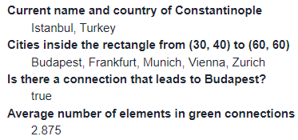

# Javascript Group Test

"Ticket-to-ride" (also known as "Zug um Zum") is a board game about building train lines between big cities. The ticket-to-ride-data.js file contains the most important data about the cities (in the array of the same name) and their connections (in the array of the same name) that are in the game. Look into the file and understand the data structures, then answer the following questions programmatically based on the provided data. (Hint: you can see the correct answers on the image below.)

Your solution goes to index.js where you can simply refer to the data structures defined in the other file (see the included console.log() calls) since they are both imported in the HTML file in the correct order.

- **a)** (2 points) Write the current name and country of the city formerly known as Constantinople into the element with ID task1.
- **b)** (2 points) List all the cities inside the rectangle bounded by points (x: 30, y: 40) and (x: 60, y: 60) into the element with ID task2.
- **c)** (3 points) Write whether there is (true or false) a connection that leads to Budapest into the element with ID task3.
- **d)** (3 points) Write the average number of elements in green connections into the element with ID task4.

Mark the tasks you solved:
- [ ] a.
- [ ] b.
- [ ] c.
- [ ] d.
